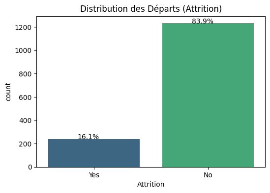
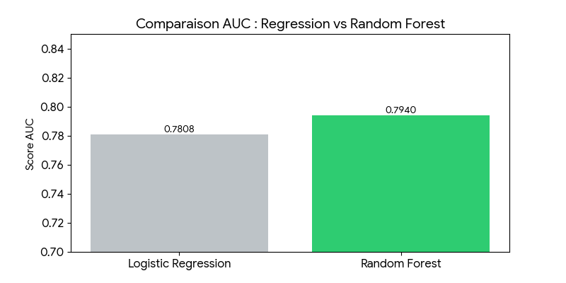
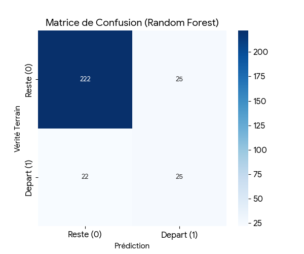

 
  
   
   
  <h1>🤖 Documentation Machine Learning</h1>
  
<strong>Justification, Analyse Exploratoire & Performance du Modèle</strong>

   

  

    
    
    
  

---

## 📊 1. Analyse Exploratoire (EDA)

Avant la modélisation, l'analyse des données a permis d'identifier les facteurs critiques influençant le départ des employés ("Attrition").

### Facteurs Clés Identifiés
L'analyse visuelle (Boxplots) révèle des différences significatives entre les employés qui partent et ceux qui restent :

1.  **Revenu Mensuel (`MonthlyIncome`)** : Les employés qui partent ont tendance à avoir un salaire médian nettement inférieur.
2.  **Âge (`Age`)** : Les départs sont plus fréquents chez les jeunes employés (début de carrière).
3.  **Ancienneté (`TotalWorkingYears`)** : Le turnover est plus fort chez les profils ayant moins d'expérience globale.

---

## 🧠 2. Sélection et Justification du Modèle

Nous avons comparé deux approches pour résoudre ce problème de classification binaire : **Régression Logistique** (modèle linéaire) et **Random Forest** (modèle ensembliste non-linéaire).

### Comparaison des Performances (AUC)

Le métrique principal retenu est l'**AUC (Area Under Curve)** car il évalue la capacité du modèle à distinguer les classes indépendamment du seuil de décision.

| Modèle | Score AUC | Observation |
|:-------|:----------|:------------|
| Régression Logistique | 0.7808 | Performant mais limité par la linéarité. |
| **Random Forest** | **0.7940** | **Meilleure performance globale.** |

### Pourquoi Random Forest ?
Le choix s'est porté sur le **Random Forest** pour trois raisons majeures :
1.  **Non-linéarité** : Les données RH contiennent des relations complexes (ex: un salaire bas n'est pas gênant si l'âge est faible, mais critique si l'âge est élevé). Le Random Forest capture ces interactions mieux qu'une régression linéaire.
2.  **Robustesse (Bagging)** : En moyennant plusieurs arbres de décision, il réduit le risque de sur-apprentissage (overfitting), un point critique sur ce dataset de petite taille (~1400 lignes).
3.  **Gestion du Déséquilibre** : Couplé à **SMOTE**, le Random Forest parvient mieux à isoler la classe minoritaire (les départs).

---

## ⚙️ 3. Optimisation et Pipeline

Pour maximiser la performance, le pipeline suivant a été mis en place :

1.  **Prétraitement** : Encodage (`LabelEncoder`) et Normalisation.
2.  **Équilibrage** : Utilisation de **SMOTE** pour générer des données synthétiques sur la classe minoritaire ("Yes").
3.  **GridSearch** : Optimisation des hyperparamètres.
    * *Meilleurs paramètres trouvés* : `max_depth=5`, `min_samples_leaf=2`.

---

## 📈 4. Résultats Finaux

### Rapport de Classification
Le modèle final présente une **Accuracy de 84%**.

| Classe | Précision | Rappel (Recall) | F1-Score | Support |
|:-------|:----------|:----------------|:---------|:--------|
| **0 (Reste)** | 0.91 | 0.90 | 0.90 | 247 |
| **1 (Départ)**| **0.50** | **0.53** | **0.52** | **47** |
| *Moyenne* | *0.84* | *0.84* | *0.84* | *294* |

### Matrice de Confusion
L'analyse de la matrice de confusion montre la capacité du modèle à détecter les départs réels :

* **Vrais Positifs (TP) : ~25** employés détectés correctement comme "à risque".
* **Faux Négatifs (FN) : ~22** employés dont le départ n'a pas été anticipé.

> **Note :** Bien que la précision sur la classe 1 soit de 50%, le **Rappel (Recall) de 53%** est un résultat encourageant pour ce type de problème déséquilibré. Cela signifie que nous parvenons à identifier plus de la moitié des démissionnaires potentiels, permettant aux RH d'agir préventivement.